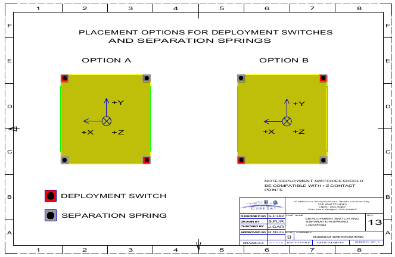
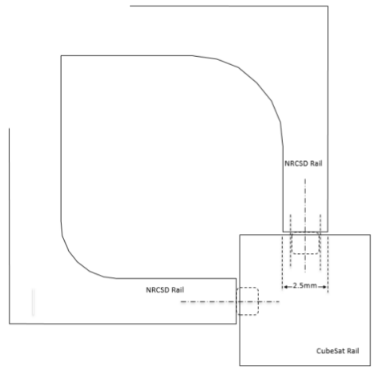
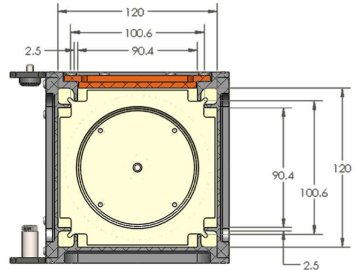
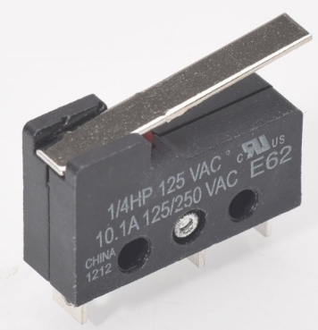
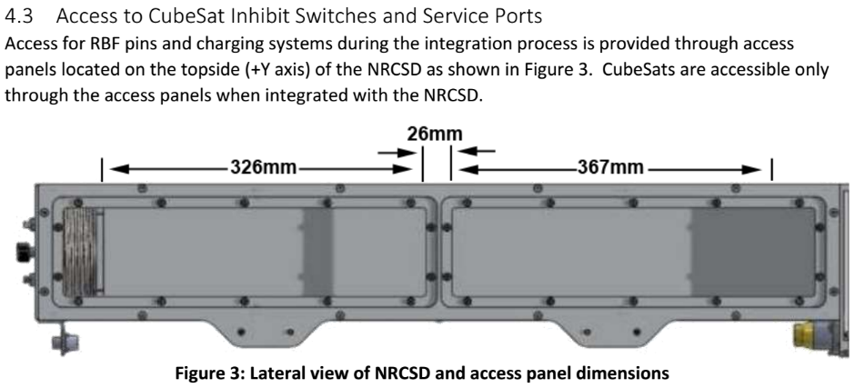
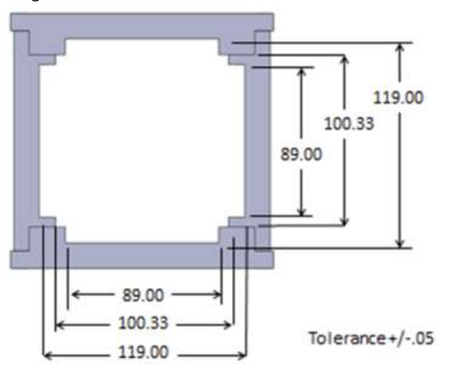
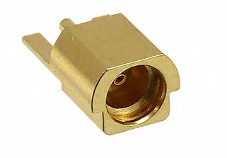
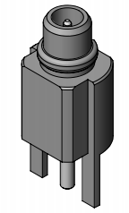

OreSat Inhibits
===============

*The markdown version of this document may be out of date. You can find the Google Docs version of this document [*here*](https://drive.google.com/open?id=1oqqp9OsMruQzNAHI35QE_UZxmF_v83l-TLrQsE882ks). If you want to update the markdown version of this document, run:*

*pandoc inhibits.docx -t markdown\_github --extract-media . -o inhibits.md*

*And copy the results into the oresat-structure repo and push them. Please make all changes to the Google Docs version.*

|     |
|-----|
|     |

0. Overview and Discussion
==========================

These notes and designs are based on the following requirements documents:

-   CubeSat Design Specification (CDS) REV 13

-   NanoRacks CubeSat Deployer (NRCSD) Interface Control Document (ICD) (NR-SRD-029) Revision 0.36

Things we need:

-   One Remove Before Flight (RBF) switch, or "pin".

-   2 deployment switches that disable the satellite.

-   1 deployment switch that disconnects the negative side of the battery pack.

More notes and thoughts:

-   We'd much rather have the negative battery disconnect go into the battery protection circuit and use the BPC MOSFETS to disconnect the batteries. Going through an actual switch is *awful* and no one should ever design a battery pack to do that. Switches suck, always.

1. Deployment switches
======================

Requirements
------------

From the CDS:

|                                                                                                                                                                               |
|-------------------------------------------------------------------------------------------------------------------------------------------------------------------------------|
| *3.3.2 The CubeSat shall have, at a minimum, one deployment switch on a rail standoff, per Figure 7.*                                                                         
                                                                                                                                                                                
 *3.3.3 In the actuated state, the CubeSat deployment switch shall electrically disconnect the power system from the powered functions; this includes real time clocks (RTC).*  
                                                                                                                                                                                
 *3.3.4 The deployment switch shall be in the actuated state at all times while integrated in the P-POD.*                                                                       
                                                                                                                                                                                
 *3.3.4.1 In the actuated state, the CubeSat deployment switch will be at or below the level of the standoff.*                                                                  |

For references, here's Figure 7:

What this means:

-   This means we need only one deployment switch, and it has to be on -Z face of one of the rails.

From the NRCSD ICD:

|                                                                                                                                                                                                                                                               |
|---------------------------------------------------------------------------------------------------------------------------------------------------------------------------------------------------------------------------------------------------------------|
| *4.7 Deployment Switches*                                                                                                                                                                                                                                     
                                                                                                                                                                                                                                                                
 *1) CubeSats shall have a minimum of three (3) mechanical deployment switches corresponding to inhibits in the main electrical system (see section on electrical interfaces). *                                                                                
                                                                                                                                                                                                                                                                
 *2) Deployment switches can be of the pusher variety, located on the –Z face on one or more of the rail end faces, or roller/lever switches embedded in a CubeSat rail and riding along the NRCSD guide rail.*                                                 
                                                                                                                                                                                                                                                                
 *3) A roller or slider shall be centered on the deployer guide rail, allowing for placement accuracy, the roller or slider shall maintain a minimum of 75% (ratio of roller/slider width-to-guide rail width) contact along the entire Z-axis (see Figure 9)*  
                                                                                                                                                                                                                                                                
 *4) Deployment switches force exerted shall not exceed 3N.*                                                                                                                                                                                                    |

For reference, here's Figure 9 and Figure 8:

What this means:

-   3 switches, in the -Z face of the rail OR in plane of the rail.

-   We have a bit more room for the RBF flag here,

DANGER DANGER WILL ROBINSON
---------------------------

The CDS says that we need only one deployment switch in the -Z face of the rails, but the NRCSD ICD says that we need 3 switches, and they can be in the -Z face of the rails OR in the rail sides. Because putting a deployment switch in the -Z face of the rails is a major bummer, and we're almost 90% likely to go with NanoRacks as our integrator, we're going to say that 3 deployment switches in the rail faces will work.

Design Notes
------------

### Plunger

According to Figure 5 in the NRCSD ICD, we have 100.6 ± 0.3 mm between the inner rails:

OreSat must be 100.0 ± 0.1 mm wide, so that leaves us with a (0.2, 0.6, 1.0) mm of slop between the CubeSat and the NRCSD rails.

Giving the slop a 10% margin means that the deployment switches MUST be activated when pushed to within 1.1 mm of the CubeSat rails. For reasons, we should also allow it to be pressed slightly into the rail, but probably not more than 0.1 mm.

When not active, the plunger may stick out an arbitrary amount past the face of the rail, but must naturally must be pressed down when manually sliding into the rails with 0 - 1.1 mm of distance between the OreSat rails and the deployer rails. This argues for a buried slope on the plunger so when the deployer rail hits the plunger, there's already a 45 degree angle to push the plunger down so it can never catch on the rail.

Further, to make sure that nothing can rattle around when we're doing maneuvers, the switch behind the plunger should be positively pressing against the plunger when the plunger is not being pushed on, so it's securely held against the rail.

### Switch

We're considering using a simple lever switch, which other folks have done. For example, [*Pumpkin's $55 space-rated switch*](http://www.pumpkinspace.com/store/p180/CubeSat_Kit_Separation_Switch.html):

Which according to their datasheet is a Cherry E62 Series (silver contacts). This is obsolete, and Cherry recommends the [*DB series*](http://switches-sensors.zf.com/us/wp-content/uploads/sites/7/2015/02/Subminiature_DB_Microswitch_Datasheet.pdf) instead, which has some great options. Here's the [*equivalent*](https://www.digikey.com/product-detail/en/zf-electronics/DB1CA1LB/CH884-ND/412581) to the pumpkin on Digi-Key.

Requirements for the switch are:

-   Must not vacuum weld shut during the several hours (days, possibly?) OreSat is sitting in the deployer outside the ISS, waiting for deployment.

-   Must not vibrate "open" given the shock and vibration from the NRCSD ICD section 6 "Launch loads".

-   PSAS Rocket Addendum: must not vibrate "closed" under flight loads from LV3/4.

2. Remove Before Flight (RBF)
=============================

The remove before flight (RBF) pin completely inhibits (shuts down) the satellite when installed. It's called a "pin" because you stick it into the satellite to shut the satellite down, and pull it out when you want the satellite to be live (independent of whatever is going on with the deployment switches).

Requirements
------------

From the CDS:

|                                                                                                    |
|----------------------------------------------------------------------------------------------------|
| *3.3.6 The RBF pin and all CubeSat umbilical connectors shall be within the designated Access*     
                                                                                                     
 *Port locations, green shaded areas shown in Appendix B.*                                           
                                                                                                     
 *3.3.7 The CubeSat shall include an RBF pin.*                                                       
                                                                                                     
 *3.3.7.1 The RBF pin shall cut all power to the satellite once it is inserted into the satellite.*  
                                                                                                     
 *3.3.7.2 The RBF pin shall be removed from the CubeSat after integration into the P-POD.*           
                                                                                                     
 *3.3.7.3 The RBF pin shall protrude no more than 6.5 mm from the rails when it is fully*            
                                                                                                     
 *inserted into the satellite.*                                                                      |

And for reference, here's the figure from Appendix B it's referring to (not +Z is to the LEFT):

What this all means:

-   Can't have the RBF in the central gap *between* the two solar panels on the +X side (around the middle of OreSat): the access panels don't really reach it. So we'll have to have to put the RBF behind a solar panel, and access it through the rectangular opening in the solar panels.

-   Because the OreSat solar arrays (with bolts) extend 6.0 mm past the plane of the rails, this gives us only 0.5 mm space to have the RBF pin. So we can't actually extend at all past the solar panels, besides maybe a thin "RBF" flag that's attached somehow to the RBF pin.

From the NRCSD ICD:

|                                                                                                                                                                                                                  |
|------------------------------------------------------------------------------------------------------------------------------------------------------------------------------------------------------------------|
| *5.1 Electrical System Design*                                                                                                                                                                                   
                                                                                                                                                                                                                   
 *4) RBF pins are required. Arming switch or captive jumpers may be an acceptable alternative; contact NanoRacks.*                                                                                                 
                                                                                                                                                                                                                   
 *5) The RBF pin shall preclude any power from any source operating any satellite functions with the exception of pre-integration battery charging.*                                                               
                                                                                                                                                                                                                   
 *6) RBF pins must be capable of remaining in place during integration with NRCSD. It shall not be necessary to remove the RBF to facilitate loading into the NRCSD.*                                              
                                                                                                                                                                                                                   
 *7) All RBF pins, switches, or jumpers utilized as primary electrical system and RBF inhibits must be accessible from the access panels (see Figure 1) for removal at the completion of loading into the NRCSD.*  |

And for reference, here's the figure from Figure 3 of the NRCSD ICD (note that the side you're looking at is the +Y side):

And Figure 8 from the NRCSD ICD:

What this all means:

-   Awww shucks: the NRCSD ICD specifically says you have to be able to keep the RBF pin in when you slide it in the deployer.

-   We have more room than the CSD says for the RBF to stick out and for the "tag": an extra 3.5 mm on each side past the ends of the solar panel fastener heads.

Plus, we have our own **OreSat requirements**. The RBF must:

-   Short the inhibit line when plugged in.

-   Have some sort of detent, or friction lock, so it can't just fall out, even under mild vibration and force.

-   Not outgass or break or whatever other space badness.

DANGER DANGER WILL ROBINSON
---------------------------

The ICD specifies the access ports on the +X side of the cubesat and the NRCSD ICD specifies the access ports on the +Y side of the *deployer*. This means that when loading OreSat into the NRCSD, they'll need to spin it 90 degrees so the +X face of OreSat is aligned with the +Y face of the deployer. We can't see any reason why this would be a problem, but we've asked NanoRacks what's up with this.

Design Notes
------------

The old-timey RBF is just a 3.5 mm mono audio jack, where the 3.55 mm audio plug has its leads shorted together. This is fine, but COTS audio jacks are awful and made of god knows what. The plugs are also ginormous.

So let's use a COTS connector, something more space-ratedy, that has two terminals. Like an MMCX connector, which we already have.

**Onboard OreSat:** We can put a right angle female, edge-mount MMCX on the inhibit card, and access it through one of the access ports in the solar arrays. We'll use the [*Samtec MMCX-J-P-H-ST-EM1*](https://www.digikey.com/product-detail/en/samtec-inc/MMCX-J-P-H-ST-EM1/SAM8837-ND/2685275):

**RBF pin:** We'll use an edge-mounted male MMCX connector on a very tiny PCB that shorts the leads and allows you to grab the connector. We'll use the [*Samtec MMCX-P-P-H-ST-EM1*](https://www.digikey.com/product-detail/en/samtec-inc/MMCX-P-P-H-ST-EM1/SAM9715-ND/6678452):

**RBF "Flag":** The RBF flag is a tag that says "REMOVE BEFORE FLIGHT" on it, which indicates to the integrators they need to remove this before they button up the deployer. When the RBF is attached, we still can't exceed the maximum bounds of the CDS. So assuming we place the flag lying flat on the solar array, and maybe tape it down for transport, that flag can only be height of the solar array fastener heads, which is 1.3 mm tall. Here's a fabric example, which is too thick because fabric and we have to use string, not a metal loop, but it gives you the idea:

